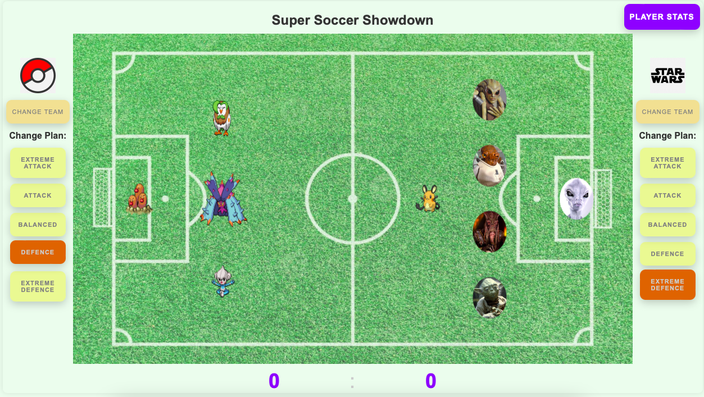
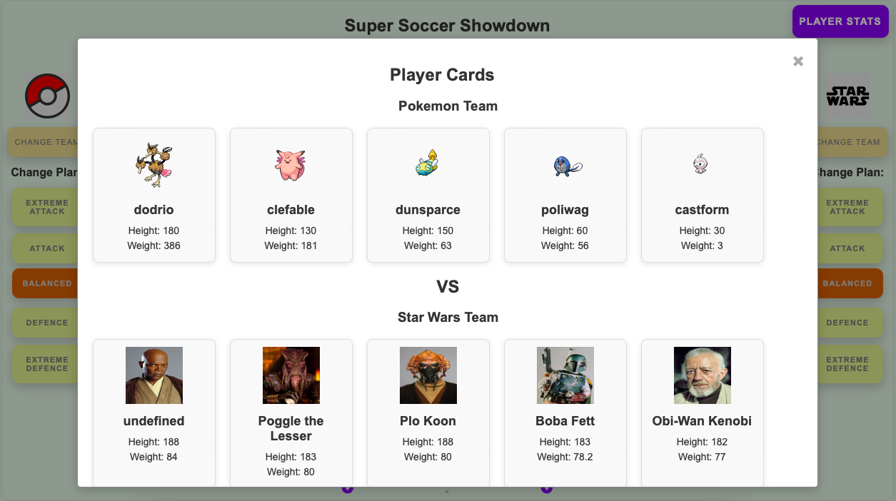

# Super Soccer Showdown

Welcome to the Super Soccer Showdown! In this project, the universes of Star Wars and Pokémon have collided in a grand soccer tournament to determine the ultimate winner.




## Project Overview

The goal of this project is to create a solution that can:

1. Generate random soccer teams from the Star Wars and Pokémon universes.
2. Ensure each team consists of exactly 5 players.
3. Assign each player a specific role based on their stats.
4. Support different lineup configurations (number of attackers and defenders).

## Features

- **Team Generation**: Use public APIs to fetch player data and generate teams.
- **Player Roles**:
  - **Goalie**: The tallest player.
  - **Defence**: The heaviest players.
  - **Offence**: The shortest players.
- **Lineup Configuration**: Different strategies for team composition.
- **User Interface**: A simple UI to generate and visualize teams.

## Public APIs

- [Star Wars API (SWAPI)](https://swapi.dev): Provides data about Star Wars characters.
- [Pokémon API (PokeAPI)](https://pokeapi.co): Provides data about Pokémon characters.

## Project Structure

The project is organized into several top-level directories to separate concerns and manage different aspects of the application. Here is an overview of the project structure:

### Top-Level Directories

- **`backend/`**: Contains the backend application code, including FastAPI endpoints and application logic.
- **`frontend/`**: Contains the front-end code for the application, using vanilla JavaScript, HTML, and CSS.
- **`docs/`**: Contains general documentation related to the project.
- **`.github/`**: Contains CI/CD configuration files, such as `ci-cd.yaml` for testing and building the backend Docker image.
- **`infrastructure/`**: Reserved for Infrastructure as Code (IaC) scripts and configurations to be used in future deployments.

### `backend/`

This directory contains the FastAPI backend application:

- **`main.py`**: The entry point of the backend application. It contains the FastAPI application setup and route definitions.
- **`src/`**: Contains the core source code of the application, organized into several subfolders:
  - **`entities/`**: Defines the core data models, including `Team` and `Player`.
  - **`clients/`**: Contains API client implementations:
    - **`api_client.py`**: Defines the abstract base class `APIClient` that other API clients inherit from.
    - **`swapi_client.py`**: Implements the `APIClient` for the Star Wars API.
    - **`pokeapi_client.py`**: Implements the `APIClient` for the Pokémon API.
  - **`utils/`**: Contains utility modules and helper functions:
    - **`team_generator.py`**: Contains the `TeamGenerator` class that generates teams based on selected API clients and strategies.
    - **`helpers.py`**: Includes helper functions used in `main.py`.
    - **`model/`**: Contains reusable types:
      - **`types.py`**: Defines common types used across the application.
- **`tests/`**: Contains unit tests that mirror the structure of the `src` folder to ensure comprehensive test coverage.

### `frontend/`

This directory contains the front-end code:

- **`index.html`**: The main HTML file for the front-end application.
- **`styles.css`**: The CSS file for styling the front-end application.
- **`scripts.js`**: The JavaScript file containing client-side logic and interactions.

## Internal Backend FastAPI Endpoints

The backend FastAPI application exposes the following endpoints:

| Method  | Endpoint                 | Description                                |
| ------- | ------------------------ | ------------------------------------------ |
| `GET`   | `/api/poketeam`          | Get the current Pokémon team               |
| `POST`  | `/api/poketeam`          | Create a new Pokémon team                  |
| `PUT`   | `/api/poketeam`          | Replace the current Pokémon team           |
| `PATCH` | `/api/poketeam/strategy` | Change the strategy for the Pokémon team   |
| `GET`   | `/api/swteam`            | Get the current Star Wars team             |
| `POST`  | `/api/swteam`            | Create a new Star Wars team                |
| `PUT`   | `/api/swteam`            | Replace the current Star Wars team         |
| `PATCH` | `/api/swteam/strategy`   | Change the strategy for the Star Wars team |

### API Details

- **`GET /api/poketeam`**: Retrieves the current Pokémon team.
- **`POST /api/poketeam`**: Generates a new Pokémon team with 5 players.
- **`PUT /api/poketeam`**: Replaces the existing Pokémon team with a new one.
- **`PATCH /api/poketeam/strategy`**: Updates the strategy for the Pokémon team. Requires a JSON body with `strategy` field.
- **`GET /api/swteam`**: Retrieves the current Star Wars team.
- **`POST /api/swteam`**: Generates a new Star Wars team with 5 players.
- **`PUT /api/swteam`**: Replaces the existing Star Wars team with a new one.
- **`PATCH /api/swteam/strategy`**: Updates the strategy for the Star Wars team. Requires a JSON body with `strategy` field.

## Running the Backend

### Run using Python virtualenv:

1. Clone the repository:

   ```bash
   git clone https://github.com/yourusername/super-soccer-showdown.git
   ```

2. Navigate to the project directory:

   ```bash
   cd super-soccer-showdown/backend
   ```

3. Set up a virtual environment:

   ```bash
   python -m venv venv
   ```

4. Activate the virtual environment:

- macOS/Linux:
  ```bash
  source venv/bin/activate
  ```
- Windows:
  ```bash
  venv\Scripts\activate
  ```

5. Install the required packages:
   ```bash
   pip install -r requirements.txt
   ```
6. Run the FastAPI application:
   ```bash
   uvicorn main:app --reload
   ```
   OR
   ```bash
   fastapi dev main.py
   ```
   The application will be available at `http://127.0.0.1:8000`.

### Run using Docker

1. Clone the repository:

   ```bash
   git clone https://github.com/yourusername/super-soccer-showdown.git
   ```

2. Navigate to the project directory:

   ```bash
   cd super-soccer-showdown/backend
   ```

3. Build the Docker image:

   ```bash
   docker build -t super-soccer-showdown .
   ```

4. Run the Docker container:

   ```bash
   docker run -p 8000:8000 super-soccer-showdown
   ```

   The application will be available at `http://localhost:8000 `

### Running Tests

To run the tests, go to the backend directory and use:

```bash
python -m unittest discover -s tests
```

OR

```bash
pytest tests
```

## Running the Frontend

While the backend is up and running, simply open the `index.html` from the **`frontend/`** directory in a browser.
